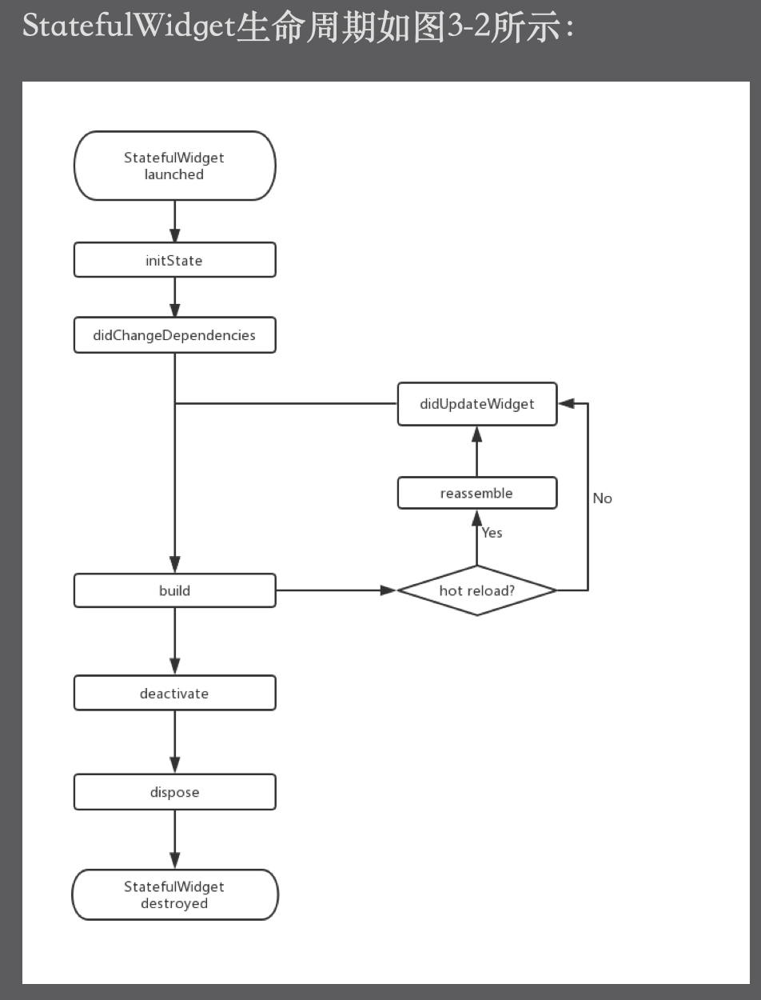

### StatefulWidget生命周期

* **initState**:当widget第一次插入到widget树时会被调用，对于每一个State对象，Flutter framework只会调用一次该回调，所以通常在该方法中做一些一次性的操作，比如状态的初始化、订阅通知等。不能再该方法中调用`BuildContext.inheritFromWidgetOfExactType`（该方法用于在Widget树上获取离当前widget最近的一个父级InertitFromWidget）,原因是在初始化完成后，widget树中的`InheritFromWidget`也可能发生变化，所以正确的做法是在`build()`或者`didChangeDependencies()`方法中调用.

* **didChangeDependencies**：当State对象的依赖发生变化时会被调用，例如：在之前build() 中包含了一个`InheritedWidget`，然后在之后的build() 中`InheritedWidget`发生了变化，那么此时`InheritedWidget`的子widget的`didChangeDependencies()`回调都会被调用。典型的场景是当系统语言Locale或应用主题改变时，Flutter framework会通知widget调用此回调。

* **build()**:此回调主要是用于构建widget子树的，会在下列场景中被调用:

  > **1.在调用`initState()`之后**
  >
  > **2.在调用`didUpdateWidget()`之后**
  >
  > **3.在调`setState()`之后**
  >
  > **4.在调用`didChangeDependencies()` 之后**
  >
  > **5.在State对象从树中一个位置移除之后(会调用`deactivate`)又重新插入到树的其它位置中**

* **reassemble()**：此回调是专门为了开发调试而提供的，在热重载(`hot reload`)时会被调用，此回调在Release模式下永远不会被调用。

* **didUpdateWidget()**：在widget重新构建时，Flutter framework会调用`Widget.canUpdate`来检测Widget树中同一位置的新旧节点，然后决定是否需要更新，如果`Widget.canUpdate`返回true则会调用此回调。正如之前所述，`Widget.canUpdate`会在新旧`widget的key`和`runtimeType`同时相等时会返回true，也就是说在在新旧widget的`key`和`runtimeType`同时相等时`didUpdateWidget()`就会被调用。

* **deactivate()**：当State对象从树中被移除时，会调用此回调。在一些场景下，Flutter framework会将State对象重新插到树中，如包含此State对象的子树在树的一个位置移动到另一个位置时（可以通过GlobalKey来实现）。如果移除后没有重新插入到树中则紧接着会调用dispose()方法。

* **dispose()**：当State对象从树中被**`永久`**移除时调用；**通常在此回调中释放资源**。

  

